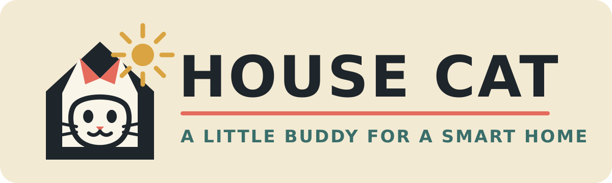
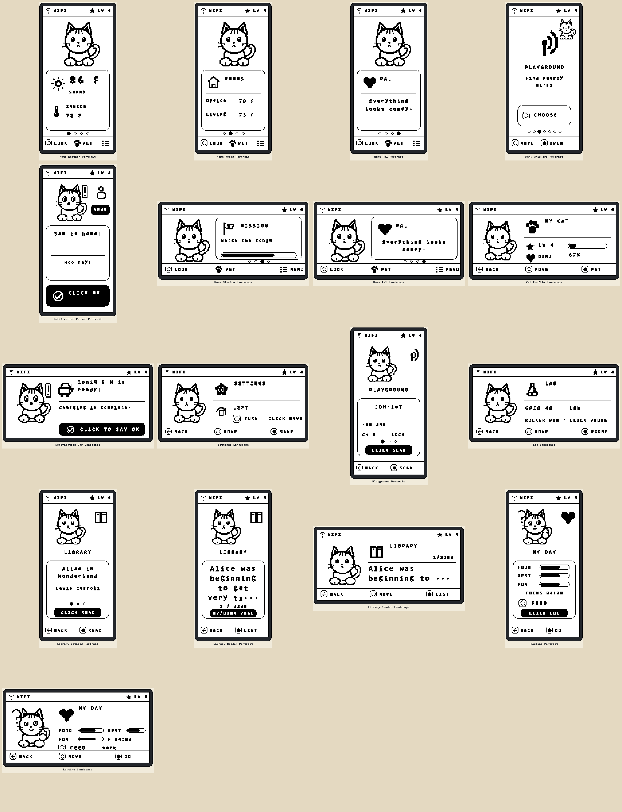
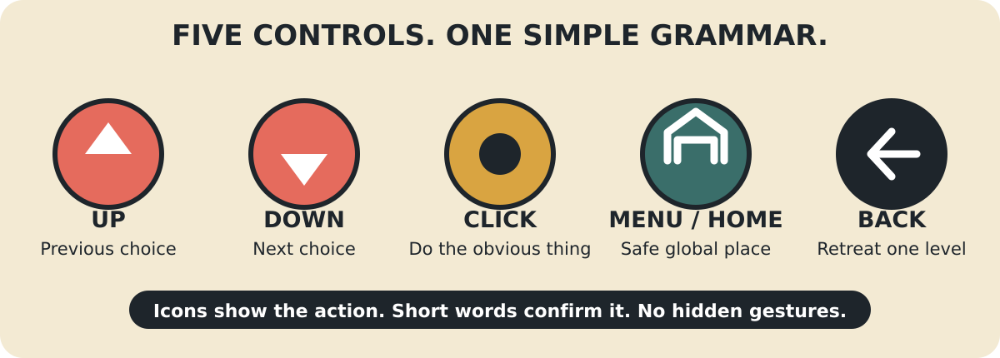
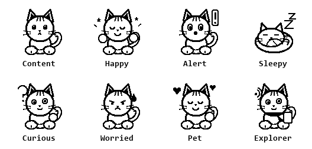

<p align="center">
  
</p>

# House Cat - CrowPanel ESP32 E-Paper Buddy

House Cat is a persistent desktop creature for the Elecrow CrowPanel ESP32 2.13-inch 122×250 black/white e-paper display. It remains a useful local buddy when disconnected, receives semantic Home Assistant events over MQTT when connected, and exposes clean seams for future wireless, reader, storage, and hardware-extension capabilities.

<p align="center">
  
</p>

## Firmware release

**Version:** `0.1.0-alpha.1`  
**PlatformIO environment:** `crowpanel_idf5` (`crowpanel` is the rollback build)  
**Target:** Elecrow CrowPanel ESP32-S3 2.13-inch E-Paper, 8 MB flash and 8 MB OPI PSRAM  
**Default mode:** fully usable offline; captive-portal Wi-Fi provisioning is available without compiling credentials

Start with [Getting Started](docs/GETTING_STARTED.md), then see the illustrated
[User Guide](docs/USER_GUIDE.md), [Troubleshooting](docs/TROUBLESHOOTING.md),
and [Security Policy](SECURITY.md).

The repository is structured as an actual PlatformIO firmware project. It contains a custom N8R8 board manifest, pinned framework and library versions, dual-OTA partitioning, hardware adapters, a serial bring-up console, native tests, host API compile checks, CI, firmware export tooling, and first-flash acceptance documentation.

## First flash on Windows

From PowerShell in the repository root:

```powershell
Set-ExecutionPolicy -Scope Process Bypass
.\scripts\bootstrap.ps1
py tools\verify_repo.py
.\scripts\build.ps1
py -m platformio device list
.\scripts\flash.ps1 -Port COM5
.\scripts\monitor.ps1 -Port COM5
```

Replace `COM5` with the port reported by PlatformIO. Leave
`include/secrets.h` absent for a portable first flash; network credentials can
be entered through the on-device captive portal.

The complete process is in [`docs/FIRST_FLASH.md`](docs/FIRST_FLASH.md). Record the results in [`docs/HARDWARE_ACCEPTANCE.md`](docs/HARDWARE_ACCEPTANCE.md).

## Qualified display behavior

The application coalesces ordinary updates and immediately schedules important
ones. The qualified JD79661 adapter presents every update with the factory full
waveform; an earlier partial waveform was removed after hardware testing showed
unstable frames.

```powershell
.\scripts\build.ps1
```

## Offline serial test console

Open a 115200-baud serial monitor and enter:

```text
help
status
buttons
person
car
alert
select
weather 93 72 sunny
mission 2 5 Find devices|Use Whiskers to discover nearby radios.
rotate 90
partial
full
```

These commands use the same application state machine as physical input and MQTT. They exercise the real renderer, notification queue, progression, mission state, orientation, persistence events, and refresh scheduler. See [`docs/SERIAL_CONSOLE.md`](docs/SERIAL_CONSOLE.md).

## First-pass implementation

- shared C++17 domain and application state machine
- exact 4,000-byte one-bit framebuffer for the 122×250 visible surface
- responsive layouts at 0°, 90°, 180°, and 270°
- eight original one-bit cat poses and a coherent 24×24 icon family
- five active-low physical controls with debouncing and buffered FreeRTOS sampling
- priority, TTL, acknowledgement, preemption, and deduplication for notifications
- cat XP, levels, bond, mood, interaction cooldown, mission progress, and NVS persistence
- semantic Home Assistant and MQTT message handling
- bundled Home Assistant MQTT device discovery, availability, state, and events
- passive nearby Wi-Fi Playground with SSID, RSSI, channel, and security browsing
- read-only Lab inspector for the CrowPanel expansion GPIO 40 and 41
- Library reader with a curated public-domain catalog, local downloads, and rocker pagination
- My Day digital-pet loop with food, rest, entertainment, meal logging, play/sleep modes,
  and a persistent 25/5 work-focus timer
- CrowPanel display adapter using Elecrow's JD79661 factory command sequence
- normal and full-refresh-safe firmware environments
- native simulator that renders through the same core as the device
- GCC and Clang native tests plus host API-shape compilation of every embedded source file
- reproducible build, flash, monitor, binary-export, checksum, and CI tooling

## Five-control UX

<p align="center">
  
</p>

| Control | Universal meaning |
|---|---|
| Rocker Up | Previous visible choice |
| Rocker Down | Next visible choice |
| Rocker Click | Perform the one obvious action |
| Home/Menu | Open the safe global menu or return Home |
| Back/Exit | Retreat one level; never silently clear a required alert |

The interface presents one dominant choice at a time, pairs imagery with short labels, keeps the cat visible on every screen, and avoids hidden gestures or tiny app grids.

## Hardware profile

The custom board definition is checked in at [`boards/crowpanel_esp32s3_213.json`](boards/crowpanel_esp32s3_213.json).

| Resource | Configuration |
|---|---|
| MCU | ESP32-S3, 240 MHz |
| Flash | 8 MB, QIO, 80 MHz |
| PSRAM | 8 MB, OPI |
| USB upload | CH340/CH34x UART bridge |
| Display | 122×250 visible black/white e-paper |
| Display profile | JD79661 with Elecrow factory initialization and waveforms |
| Application slots | two 0x2F0000 OTA partitions |
| Local data | 2 MiB LittleFS-compatible partition |
| Diagnostics | 64 KiB core-dump partition |
| Playground | passive asynchronous Wi-Fi scan; no connection or disruption actions |
| Lab | GPIO 40/41 input-only sampling with internal pull-ups |

The exact pin map and electrical bring-up order are documented in [`docs/HARDWARE.md`](docs/HARDWARE.md).

Library controls, storage behavior, public-domain sourcing, and transport limitations are documented in [`docs/LIBRARY.md`](docs/LIBRARY.md).

## Repository map

```text
housecat-crowpanel-pio/
├── assets/source/                Original one-bit sprite and icon PNGs
├── boards/                       Custom PlatformIO CrowPanel N8R8 board
├── branding/                     House Cat vector mark
├── dist/                         Versioned firmware exports after a PIO build
├── docs/                         Product, UX, hardware, testing, and protocols
│   └── diagrams/                 DOT sources plus rendered SVG/PNG diagrams
├── homeassistant/                Package, scripts, and automation examples
├── include/                      Configuration and ignored local secrets
├── lib/housecat_core/            Platform-independent domain, app, and UI
├── previews/                     Sprite sheets and real renderer snapshots
├── scripts/                      Bootstrap, build, flash, and monitor helpers
├── simulator/                    Native exact-pixel renderer
├── src/board/                    Display, input, diagnostics, and persistence
├── src/integrations/             MQTT bridge and serial test console
├── test/                         Native tests and embedded API-shape stubs
├── tools/                        Verification, assets, previews, and export
├── platformio.ini                Pinned ESP32-S3 firmware environments
└── partitions.csv                Dual OTA, data, and core-dump layout
```

## PlatformIO build and export

Install the pinned PlatformIO Core:

```bash
./scripts/bootstrap.sh
```

Verify and build:

```bash
python3 tools/verify_repo.py
./scripts/build.sh crowpanel_idf5
```

A successful build is exported to:

```text
dist/housecat-0.1.0-alpha.1/crowpanel_idf5/
```

The export contains individual flash images, offsets, checksums, a JSON manifest, raw esptool helpers, and a merged image when esptool merging is available.

Create a clean checksummed source release, excluding build output and local secrets:

```bash
python3 tools/package_source.py --output ..
```

The firmware dependency set is pinned in `platformio.ini`:

- pioarduino ESP32 platform `55.03.39` / Arduino 3.3.9 for the shipping build
- PlatformIO Espressif32 `7.0.1` for the rollback build
- PubSubClient `2.8`
- ArduinoJson `7.4.3`

## Native build and simulator

Requirements: CMake 3.20+, a C++17 compiler, and optionally Ninja.

```bash
cmake -S . -B build -G Ninja -DCMAKE_BUILD_TYPE=Release
cmake --build build
ctest --test-dir build --output-on-failure
./build/housecat_simulator previews/native
python3 tools/build_previews.py
```

The simulator renders the same `HouseCatApp`, `UiRenderer`, bitmaps, fonts, orientation transform, and layout decisions used by the firmware. It is the fastest path for UI iteration without repeatedly refreshing the physical panel.

## Wi-Fi and MQTT configuration

After offline hardware acceptance succeeds, copy the safe template to the ignored local file:

```powershell
Copy-Item include\secrets.example.h include\secrets.h
```

```cpp
#define HOUSECAT_WIFI_SSID "YourWifi"
#define HOUSECAT_WIFI_PASSWORD "YourPassword"
#define HOUSECAT_TAILSCALE_EXIT_NODE_IP ""
#define HOUSECAT_MQTT_HOST "10.0.0.10"
#define HOUSECAT_MQTT_PORT 1883
#define HOUSECAT_MQTT_REMOTE_HOST ""
#define HOUSECAT_HOME_NETWORK_PREFIX ""
#define HOUSECAT_MQTT_REMOTE_IPV4 0UL
#define HOUSECAT_MQTT_USERNAME "housecat"
#define HOUSECAT_MQTT_PASSWORD "YourMqttPassword"
#define HOUSECAT_DEVICE_ID "housecat-desk-01"
#define HOUSECAT_DEVICE_NAME "House Cat"
#define HOUSECAT_CAT_NAME "Kitty"
```

Do not commit or redistribute `include/secrets.h`.

Notification topic:

```text
housecat/housecat-desk-01/command/notification
```

```json
{
  "id": "sam-home-test",
  "title": "Sam is home!",
  "body": "Hoo-ray!",
  "kind": "person",
  "priority": "notice",
  "ttl_s": 180,
  "ack": false
}
```

Home snapshot topic:

```text
housecat/housecat-desk-01/command/home
```

```json
{
  "outside_f": 93,
  "inside_f": 72,
  "condition": "sunny",
  "condition_label": "Sunny",
  "rooms": [
    {"name": "Office", "temperature_f": 70, "humidity": 39},
    {"name": "Living", "temperature_f": 73, "humidity": 42}
  ]
}
```

The complete contract and retention rules are in [`docs/MQTT_CONTRACT.md`](docs/MQTT_CONTRACT.md). A ready-to-customize Home Assistant package is in [`homeassistant/housecat_package.yaml`](homeassistant/housecat_package.yaml).

## Art pipeline

<p align="center">
  
</p>

The UI uses packed one-bit bitmap artwork, not emoji, Unicode blocks, or ASCII approximations. The generated C++ asset header is checked in, so Python and source-font files are not firmware build dependencies.

```bash
python3 tools/generate_assets.py
```

See [`docs/ASSET_PIPELINE.md`](docs/ASSET_PIPELINE.md).

## Documentation

- [`docs/FIRST_FLASH.md`](docs/FIRST_FLASH.md): workstation setup, flash, offline test, network enablement
- [`docs/HARDWARE_ACCEPTANCE.md`](docs/HARDWARE_ACCEPTANCE.md): physical qualification checklist and measured evidence
- [`docs/SERIAL_CONSOLE.md`](docs/SERIAL_CONSOLE.md): complete offline command reference
- [`docs/PRODUCT_FIRST_PASS.md`](docs/PRODUCT_FIRST_PASS.md): product boundary and acceptance criteria
- [`docs/UX.md`](docs/UX.md): toddler-grade interaction grammar and screen behavior
- [`docs/ARCHITECTURE.md`](docs/ARCHITECTURE.md): layers, events, rotation, and extension seams
- [`docs/HARDWARE.md`](docs/HARDWARE.md): pin map, board profile, partitioning, and smoke test
- [`docs/NETWORK_PROVISIONING.md`](docs/NETWORK_PROVISIONING.md): captive Wi-Fi recovery and Tailscale enrollment
- [`docs/MQTT_CONTRACT.md`](docs/MQTT_CONTRACT.md): topics, payloads, priority, TTL, and discovery
- [`docs/ROADMAP.md`](docs/ROADMAP.md): first flash through a stable v1 platform
- [`docs/TESTING.md`](docs/TESTING.md): automated and physical test strategy
- [`docs/VALIDATION_RESULTS.md`](docs/VALIDATION_RESULTS.md): proven behavior and remaining hardware gates

## Validation boundary

This package has been validated through native GCC and Clang Release builds, unit tests, exact-pixel simulator rendering, structural verification, YAML/XML parsing, Python syntax checks, and host compilation of all embedded translation units against API-shaped Arduino/ESP32 stubs.

The packaging environment did not contain the PlatformIO ESP32-S3 cross-toolchain or the physical CrowPanel. Therefore, it does not claim that a target `.bin` has been produced or flashed here. `scripts/build.*`, the PlatformIO workflow, and the acceptance checklist are included specifically to make that next gate reproducible and auditable.

## Architecture

<p align="center">
  
</p>

> Home Assistant tells House Cat what happened. Controls tell House Cat what the user did. The application decides what it means. The renderer decides how to show it.

## Upstream references

- Elecrow product page: https://www.elecrow.com/crowpanel-esp32-2-13-e-paper-hmi-display-with-122-250-resolution-black-white-color-driven-by-spi-interface.html
- Elecrow source repository: https://github.com/Elecrow-RD/CrowPanel-ESP32-2.13-E-paper-HMI-Display-with-122-250
- PlatformIO Espressif32: https://github.com/platformio/platform-espressif32
- Home Assistant MQTT integration: https://www.home-assistant.io/integrations/mqtt/
