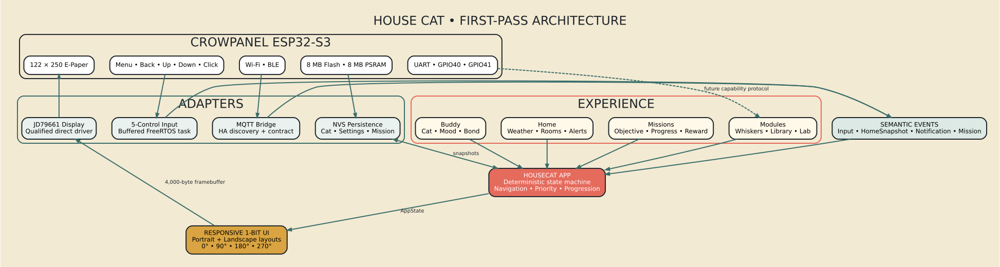
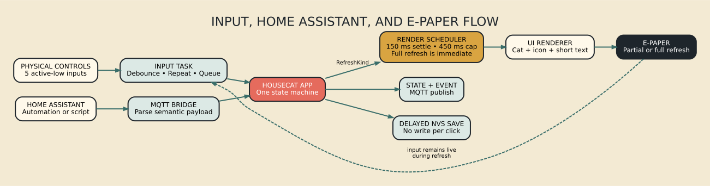
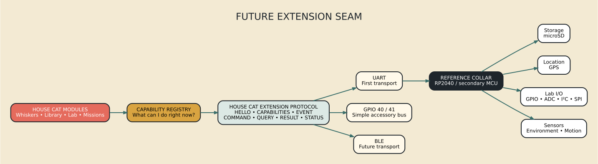

# House Cat First-Pass Architecture



## Structural rule

Transport, hardware, and Home Assistant payloads never select a screen directly. They update the domain or dispatch an input action. The application decides what the event means; the renderer decides how it fits the current orientation.

## Layers

### Domain

- `CatState`: identity, level, XP, bond, interactions, and mood
- `HomeSnapshot`: normalized outside, inside, and room readings
- `Mission`: provider-independent objective and progress
- `Notification`: semantic kind, priority, TTL, and acknowledgement policy
- `Settings`: orientation and UI behavior

### Application

`HouseCatApp` is the deterministic state machine. It owns navigation, progression reactions, notification preemption, refresh requests, and the universal physical input grammar.

The application returns a `DispatchResult` rather than talking to the display, MQTT broker, or flash. This keeps the core natively testable.

### UI

`MonoCanvas` is a fixed 122×250 one-bit framebuffer with a logical orientation transform. `UiRenderer` has two responsive layout families:

- portrait for 0° and 180°
- landscape for 90° and 270°

The layout reflows at the logical level. It does not render a portrait screen and rotate the finished bitmap.

### Adapters

- `CrowPanelInput`: debounced, repeat-aware FreeRTOS input producer
- `CrowPanelDisplay`: direct, qualified JD79661 panel adapter
- `PreferencesStore`: small NVS snapshot
- `MqttBridge`: Wi-Fi, MQTT parsing, discovery, state, and event publication
- `LibraryReader`: transactional HTTPS download, LittleFS cache, indexing, and resume
- `PlaygroundLab`: passive Wi-Fi scan and read-only expansion-pin sampling

Protocol-facing enum names and parsers live in `app/semantics.h`; MQTT and the
serial console consume the same mappings rather than maintaining parallel
switch statements.

### Assets

Original source sprites and icons are generated by `tools/generate_assets.py`. The checked-in generated header contains packed one-bit bitmaps and rasterized glyphs, so embedded builds do not depend on Python or local font files.

## Runtime event flow



1. Input or MQTT produces a semantic action.
2. `HouseCatApp` mutates state and returns a refresh directive plus an optional event.
3. The render scheduler coalesces ordinary changes but immediately presents urgent full-refresh work.
4. `UiRenderer` paints one deterministic framebuffer.
5. The panel adapter promotes either logical request to the qualified full JD79661 waveform.
6. Relevant domain changes are published and eventually persisted.

## Rotation model

The physical buffer remains 122×250. Logical coordinates map as follows:

```text
0°:   physical(x, y)       = logical(x, y)
90°:  physical(x, y)       = (121 - y, x)
180°: physical(x, y)       = (121 - x, 249 - y)
270°: physical(x, y)       = (y, 249 - x)
```

Logical dimensions are 122×250 in portrait and 250×122 in landscape.

## Extension seam



The first pass exposes module shells but deliberately avoids dynamic executable plugins. The next protocol layer should advertise capabilities such as storage, GPS, GPIO, sensor, or stream. Modules consume capabilities rather than concrete accessory models.
