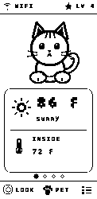
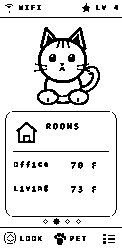
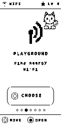
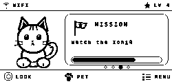
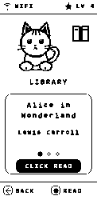
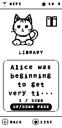
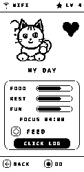
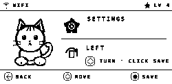

# User guide

House Cat is designed around five physical controls. **Up/Down** moves the
visible selection, **Rocker Click** activates it, **Menu** opens the global
menu or returns Home, and **Back** retreats one level. Inputs pressed during an
e-paper refresh are buffered; wait for the refresh to finish before assuming a
press was missed.

## Home and rooms

Home cycles through Weather, Rooms, Mission, and Pal cards. Rooms come from the
Home Assistant home-snapshot MQTT message. If it says “No room sensors yet,”
confirm the package entity IDs and broker topics rather than re-flashing.

## Menu, missions, and notifications

Missions show a title, instruction, and progress supplied over MQTT. Important
notifications may preempt the current screen; required alerts remain until
Rocker Click acknowledges them.

## Library reader

Open **Library**, choose a downloaded public-domain title, and use Up/Down to
page. Back returns to the catalog. Books are downloaded only on request and
stored locally. Details and source policy are in [LIBRARY.md](LIBRARY.md).

## My Day and pet care

My Day includes food, rest, entertainment, meal logging, play/sleep modes, and
a persistent focus timer. Petting on Home increases bond subject to a cooldown;
progress is saved in NVS.

## Settings and travel

Settings changes orientation and exposes diagnostics. Playground passively
lists nearby Wi-Fi; it never attacks or joins a network. If the saved network
is unavailable for 30 seconds, the setup portal opens so House Cat can travel
to another network. When configured, the embedded Tailscale client reconnects
and selects the owner's exit-node peer; the firewall continues to deny other
private IPv4 destinations.

